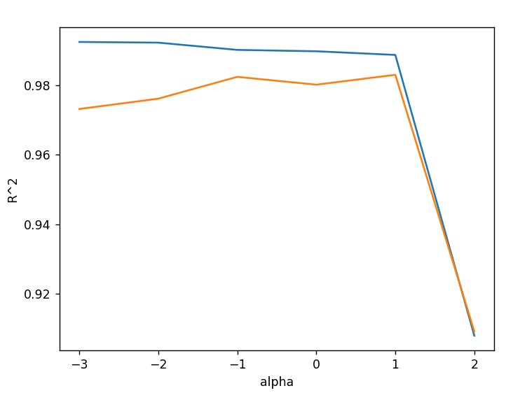

# ML-Regression

You can learn K-NN Regression, Linear Regression, Polynomial Regression, Multiple Regression, Ridge and Lasso.

Unlike classification, regression predicts "value" of the target. 

You can think regression as "function".

------------------------------------
## How to use this repo

- You have to install python and pip.  
  Install python : <https://www.python.org/downloads/>

- Install pipenv if you don't have.

      pip install pipenv

- clone this repo. (or you can just copy and paste this repo.)

      git init
      git clone https://github.com/JiunJung/ML-Regression.git

- After you clone this repo, you have to install dependencies.

      pipenv install

- And, you can run python file like below.
      
      pipenv run python knn-regression.py

---------------

## K-NN Regression

    pipenv run python knn-regression.py

K-NN regression predicts target using the "average of several close values".

Here are the result of prediction using K-NN Regression

This model predicts 50cm tall perch's weight as 1000g which is similar to 40~45cm tall perches.

Can you tell the problem of K-NN Regression algorithm?

The problem is, when the model predicts target, it just uses given data.

And we have to find another algorithm which finds the graph(function). So that, we could know the general tendency of the data.

---------------------------------------

## linear Regression 

    pipenv run python linear-regression.py

To solve the problem above, we need linear regression algorithm.

Linear regression finds the best parameter for linear function. 

Here is a general linear function : y = ax + b

'a' is called coefficient or weight. And 'b' is called intercept.

Both of them are called "model parameter."

Let's see the result of linear regression.

It predicted 50cm tall perch's weight quite reasonably.

But, there's a problem. The graph can go through the X axis and then, target value could be a negative value. But, there is no negative value for weight!

So, we have to find another algorithm.

------------------------

## Polynomial Regression

    pipenv run python polynomial-regression.py

We use quadratic function in polynomial regression. We can even use higer order functions.

When you see the score of this model, it is better than linear regression above. 

But, this model still underfitted.

And, we can solve that problem using more feature.

------------------

## Multiple Regression, Ridge, Lasso.

      pipenv run python multiple-regression.py

Using more feature, we can make regression model more complicated and accurate.

But, if it is too much, we have to regularize it.

And we use Ridge and Lasso to regularize regression model.

For more detail, see the comments in multiple-regression.py file in this repo.

[process to find the best alpha parameter in Ridge.]

 

[process to find the best alpha parameter in Lasso.]

